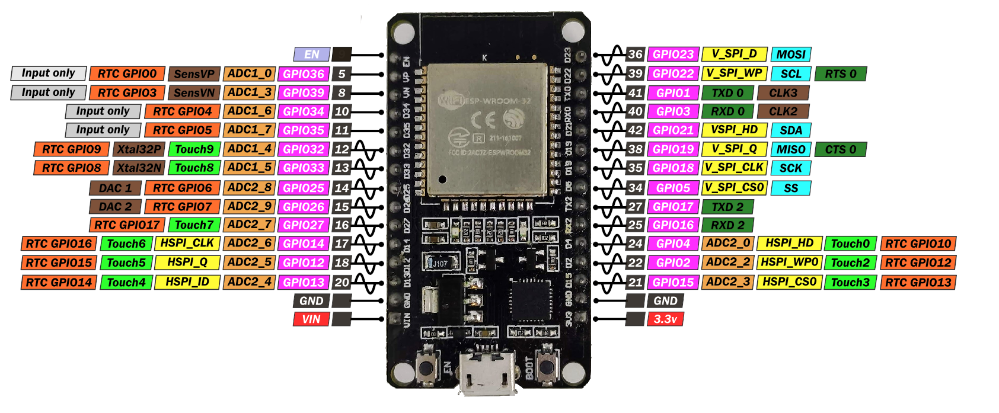
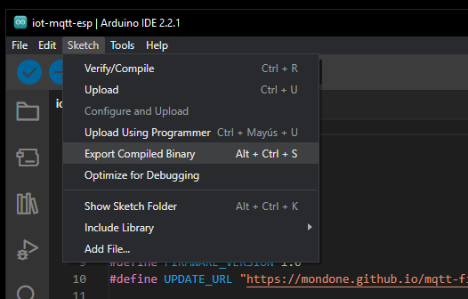
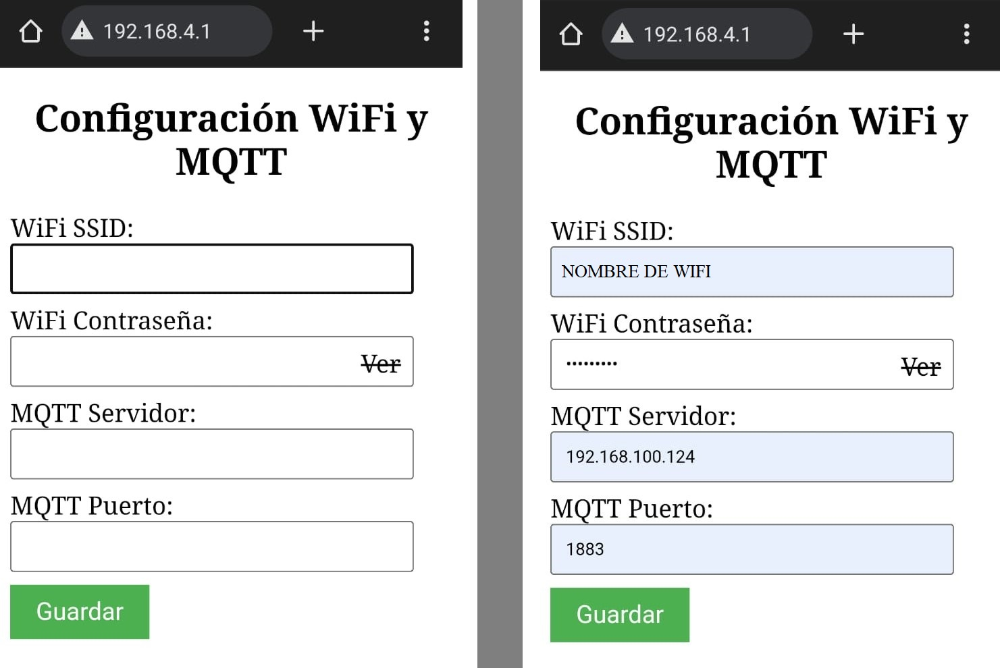
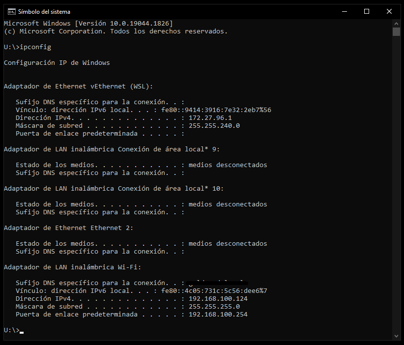
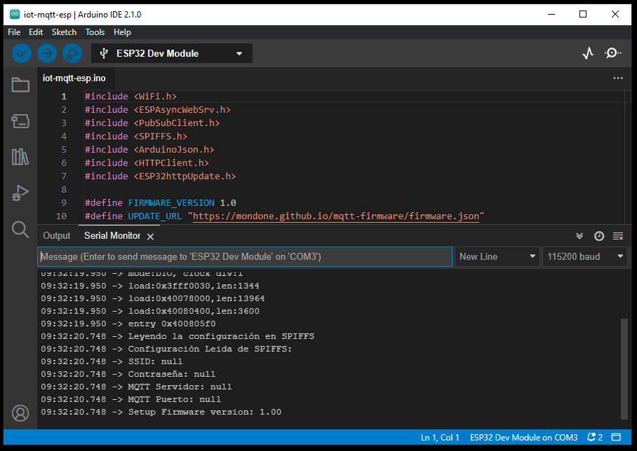
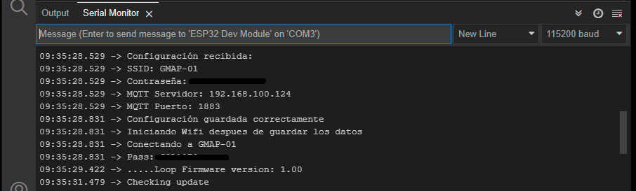
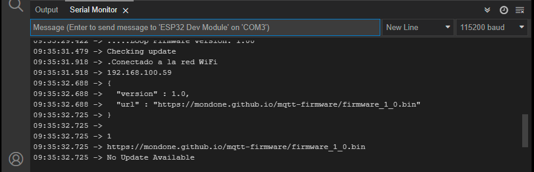
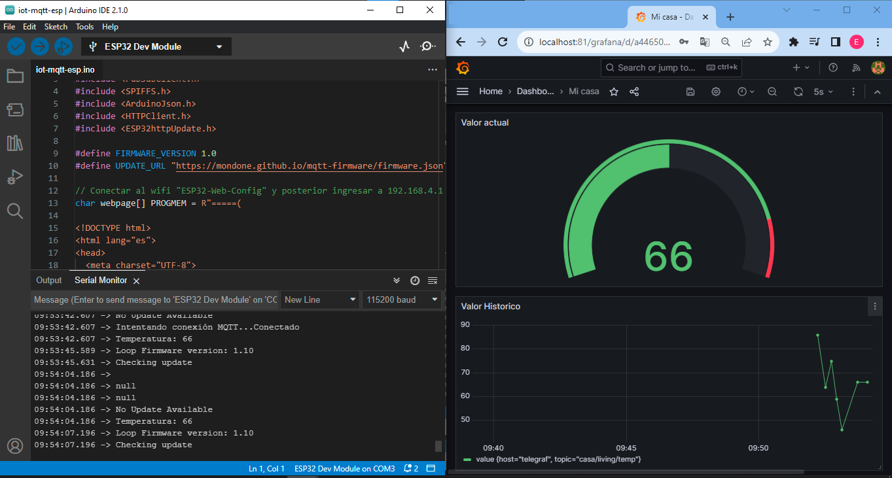

# IoT Mqtt Esp Ota + Docker

Este proyecto facilita la automatización de un microcontrolador Esp32 para la conexión mediante MQTT a un servidor local alojado en Docker. El dispositivo se conecta en modo AP, creando una red WiFi. Posteriormente, al acceder a una página web, podemos configurar credenciales la conexión WiFi y MQTT.

# Requerimientos

Implementar el código necesario para configurar un Esp32 con las credenciales de WiFi y de un servidor MQTT a través de una interfaz gráfica. Además, se deberá permitir la actualización remota del firmware del Esp.

El esp32 deberá ser capaz de conectarse a la base de datos alojada en la imagen docker, la cual mostrara los datos enviados mediante MQTT en una pagina web.

# Instalacion

## Docker: 

- En la carpeta software-docker se encuentra el archivo readme.md, con la descripción de la imagen de docker y su instalación. 

## Esp32:

[](https://www.espressif.com/en/products/socs/esp32)
[](https://www.espressif.com/en/products/socs/esp32-s2)
[](https://www.espressif.com/en/products/socs/esp32-c3)

Para la instalacion del codigo en el esp32, utilizaremos el ide de Arduino. https://www.arduino.cc/en/software

- En la carpeta hardware-esp se encuentran los archivos necesarios para instalar el código en nuestro esp32, antes de instalar debemos seguir los pasos de la actualización de firmware.


Ejemplo Esp32 de 30 pines modelo devkitV1.


## Actualización de firmware:

El firmware se actualiza mediante OTA vía http, por lo tanto antes de instalar el código en nuestro esp32, debemos crear un repositorio en github o algún servidor donde alojar los archivos necesarios para la actualización.

Librerías utilizadas.
```cpp
#include <HTTPClient.h>
#include <ESP32httpUpdate.h>
```
Repositorio en github para este proyecto: https://github.com/Mondone/mqtt-firmware

En el Esp32 se define la versión del firmare actual, y una url donde estará alojado un archivo en formato Json. Con este archivo Json el esp32 es capaz de comparar la versión y actualizarse. 

- Código en Arduino
```cpp
#define FIRMWARE_VERSION 1.0
#define UPDATE_URL "https://mondone.github.io/mqtt-firmware/firmware.json"
```
- Archivo firmware.json
```cpp
{
    "version": 1.0,
    "url": "https://mondone.github.io/mqtt-firmware/firmware_1_0.bin"
}
```
En el archivo firmaware.json tendrá dos campos uno para la versión y otro para guardar la url con la ultima versión disponible en formato "bin". 
 
El Arduino Ide tiene la opción de exportar el código en formato ".bin".

- imagen de ejemplo



Una ves que tenemos las direcciones de nuestro host funcionando correctamente, podremos grabar el código en el esp32. 

Para que el Esp32 se actualice debemos subir la nueva versión del firmware. Y editar los campos del archivo Json. Siguiendo estos pasos el esp32 es capas de actualizarse una ves que este conectado a a la red wifi.

- Archivo firmware.json editado el campo versión a 1.1, y firmware_1_1-bin.

```cpp
{
    "version": 1.1,
    "url": "https://mondone.github.io/mqtt-firmware/firmware_1_1.bin"
}
```


# Utilización:

Después de instalar el código, el Esp32 iniciara en en modo AP "Access Point", creara una red Wifi de nombre "ESP32Web-" que termina con los ultimos 5 digitos de la dirección MAC del dispositivo. Ejemplo: "ESP32Web-F4:9C".

Una vez visible la red, debemos conectarnos. Posiblemente nos diga que no tiene conexión a internet, posterior a eso debemos ir a un navegador e ingresar la dirección IP "192:168:4:1" sin comillas.

- Librerias utilizadas.
```cpp
#include <WiFi.h>
#include <ESPAsyncWebSrv.h>
```
- Variables para almacenar las credenciales.
```cpp
String ssid = "";
String password = "";
String mqtt_server = "";
String mqtt_port = "1883";

```

- Imagen portal Web de configuracion




Este proyecto tiene como objetivo establecer una conexión con una imagen Docker en la que se ejecutan una base de datos y un servidor MQTT. Por lo tanto, la dirección IP que debemos ingresar en el campo 'MQTT Servidor' será la del equipo donde se está ejecutando Docker, y la red WiFi debe ser la misma a la que está conectada dicho equipo.

Para obtener la dirección IP de nuestra máquina (donde se ejecuta Docker), en la barra de búsqueda de Windows, escribimos "cmd" y presionamos "Enter". En la ventana de la terminal que se abre, escribimos "ipconfig" y volvemos a presionar "Enter".

La sección que termina en "WSL" corresponde al adaptador de red virtual utilizado por Docker. Sin embargo, el IP que debemos utilizar es el de la PC.

En este ejemplo, si la PC está conectada a través de Wi-Fi, buscamos la sección etiquetada como "Adaptador de LAN inalámbrica Wi-Fi:" y copiamos la dirección IP indicada en "Dirección IPv4".

```cpp
Dirección IPv4. . . . . . . . . . . . . . : 192.168.100.124
```



Una vez que todos los datos se carguen y se haga clic en 'Guardar', las credenciales se almacenarán en la memoria interna del ESP32.

El ESP32 se conectará a la red WiFi y al servidor MQTT para empezar a enviar valores de temperatura generados aleatoriamente. Estos valores se mostrarán en la página web de Grafana.

La imagen de Docker incluye un script de Python llamado 'publisher' que simula la carga de dispositivos IoT. Este script se puede detener si solo deseamos ver en el gráfico las lecturas del ESP32 real.


- Inicio del Esp32



- Recibo de la la información cargada al Esp32



- Conexión a internet y chequeo de versión.



- Conexión a MQTT y Subida de informacion en la base de datos




